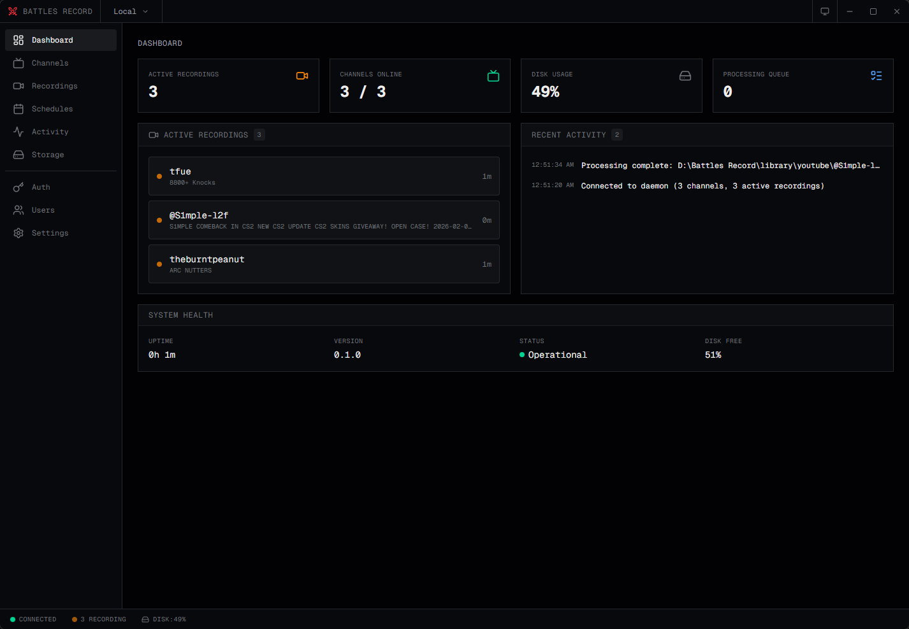
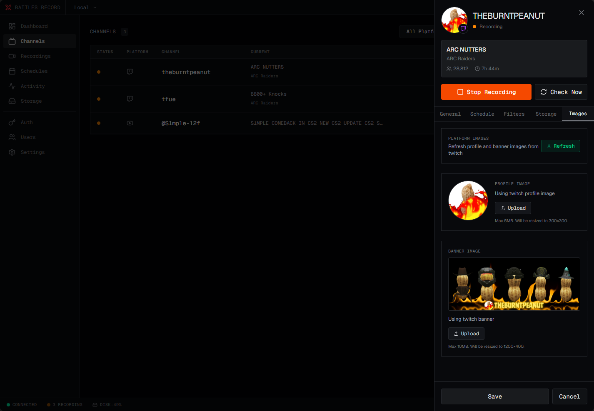
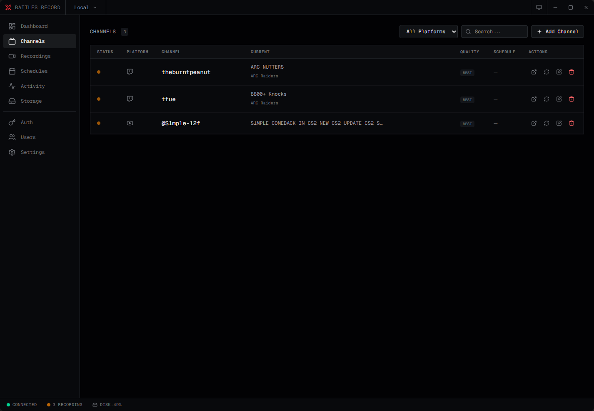
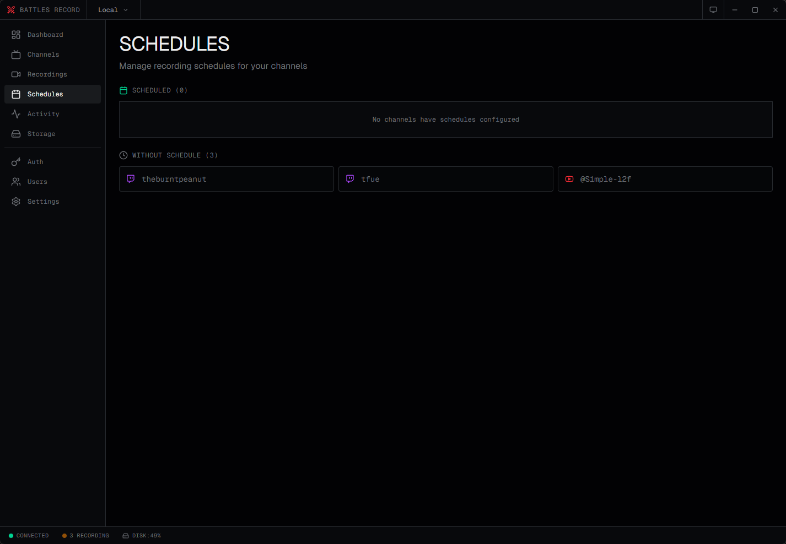
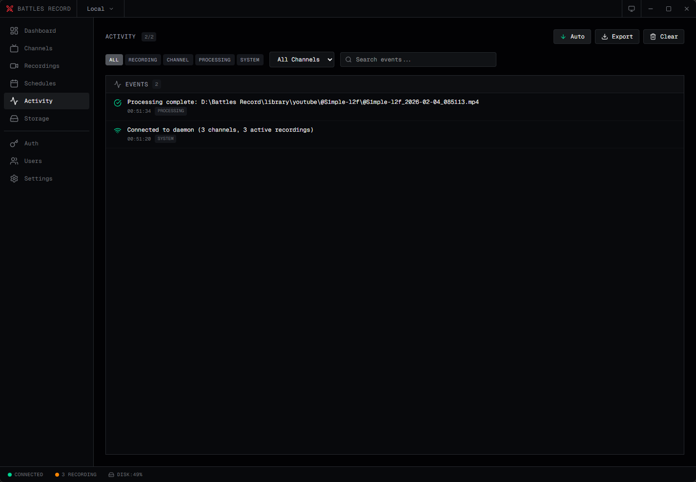
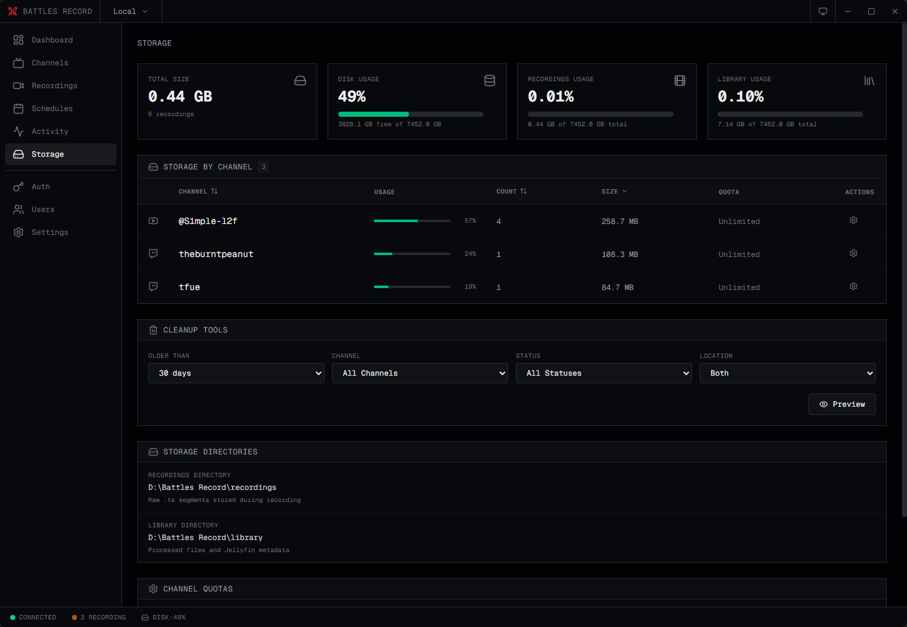
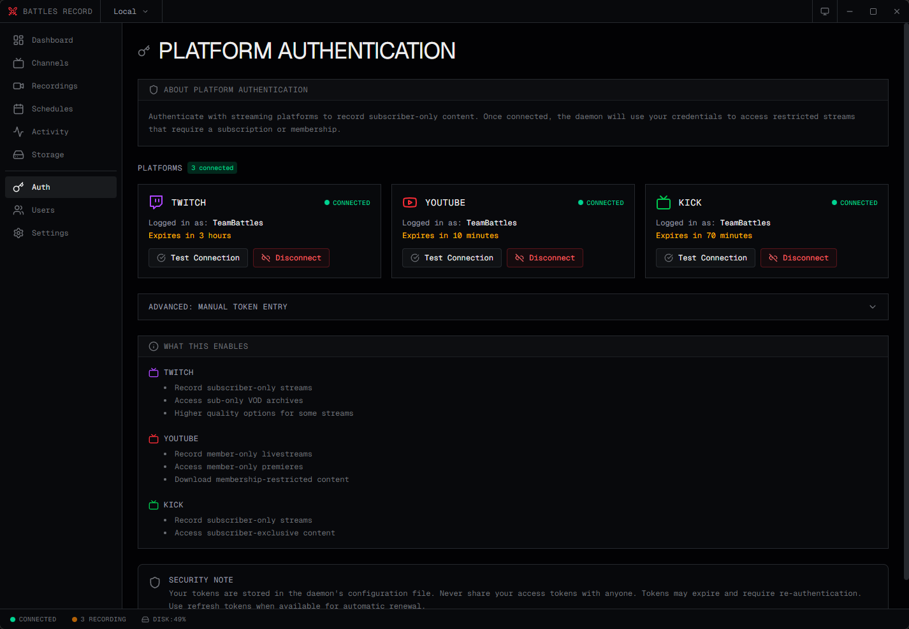
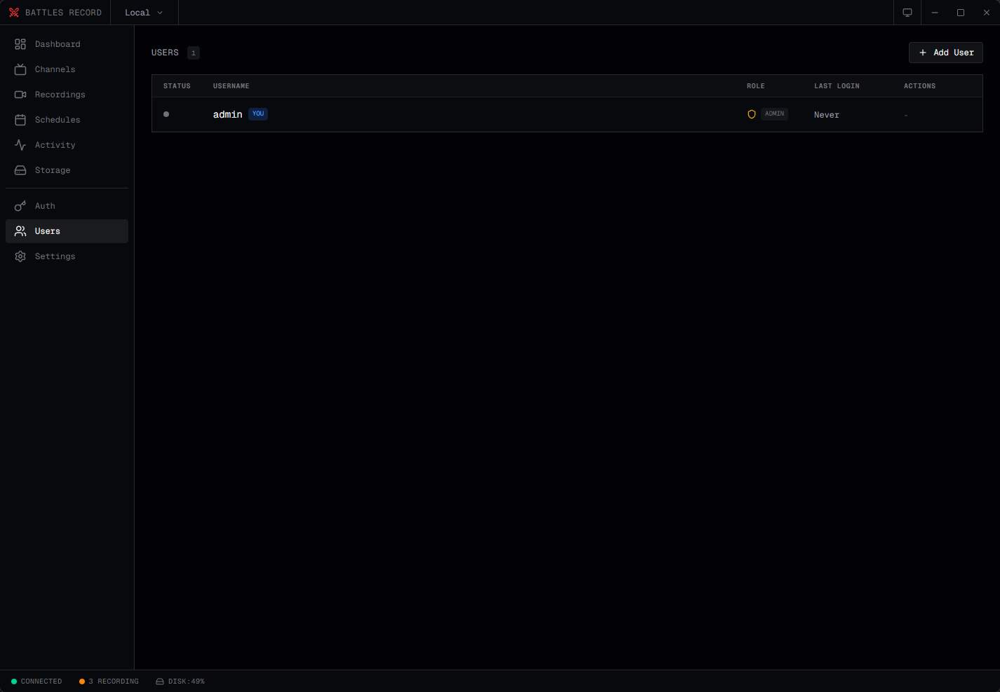
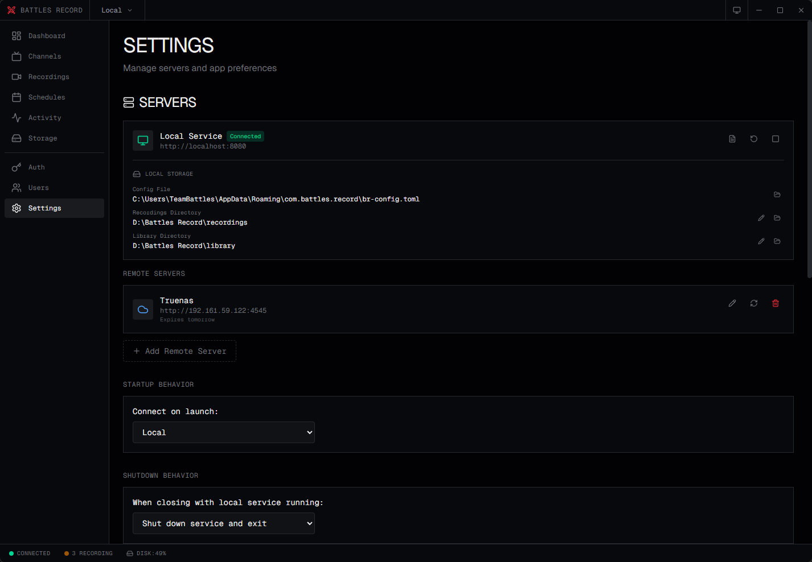

<p align="center">
  
</p>

<h1 align="center">Battles Record</h1>

<p align="center">
  <strong>Automatically record live streams from Twitch, YouTube, and Kick</strong>
</p>

<p align="center">
  <a href="#-features">Features</a> •
  <a href="#-screenshots">Screenshots</a> •
  <a href="#-quick-start">Quick Start</a> •
  <a href="#-docker-installation">Docker</a> •
  <a href="#-desktop-app">Desktop App</a> •
  <a href="#-configuration">Configuration</a>
</p>

<p align="center">
  
  
  
  <a href="https://ko-fi.com/teambattles"></a>
</p>

---

Battles Record monitors your favorite streamers and automatically captures their broadcasts. When a channel goes live, it detects the stream, downloads segments in real-time, and assembles them into a final video file-all without manual intervention.

## ✨ Features

- **📺 Multi-Platform Support** - Record from Twitch, YouTube, and Kick
- **🔄 Background Recording** - Runs as a daemon with no manual intervention required
- **🎯 Quality Selection** - Choose from source quality down to 360p or audio-only
- **⬇️ Video Downloads** - Download VODs and clips via yt-dlp with queue management
- **🧩 Browser Extension** - Battles Replay integration for one-click downloads and channel management
- **⚡ Post-Processing** - Automatically encode recordings to MP4 with configurable quality
- **💾 Storage Management** - Per-channel quotas, retention policies, and automatic cleanup
- **📅 Scheduling** - Record only during specific time windows with timezone support
- **🔍 Content Filters** - Record based on stream title, game/category, or viewer count
- **📺 Jellyfin Integration** - Export to Jellyfin-compatible library with NFO metadata
- **🔔 Notifications** - Discord, Telegram, and webhook notifications
- **📦 Library Management** - Auto-install and update yt-dlp, FFmpeg, and Bun
- **🖥️ Desktop App** - Beautiful Tauri + SvelteKit interface with system tray support
- **🐳 Docker Ready** - Containerized deployment with NVIDIA GPU support

### Platform Support

| Platform | Live Detection | Quality Selection | Subscriber Streams | OAuth |
| -------- | :------------: | :---------------: | :----------------: | :---: |
| Twitch   |       ✅       |        ✅         |         ✅         |  ✅   |
| YouTube  |       ✅       |        ✅         |         ✅         |  ✅   |
| Kick     |       ✅       |        ✅         |         -          |  ✅   |

---

## 📸 Screenshots

<details>
<summary><strong>Dashboard</strong> - Overview of active recordings and system status</summary>



</details>

<details>
<summary><strong>Channels</strong> - Manage channels with detail panel</summary>



</details>

<details>
<summary><strong>Recordings</strong> - Browse and manage all recordings</summary>



</details>

<details>
<summary><strong>Schedules</strong> - Configure recording time windows</summary>



</details>

<details>
<summary><strong>Storage</strong> - Monitor disk usage and quotas</summary>



</details>

<details>
<summary><strong>Activity Log</strong> - Real-time event stream</summary>



</details>

<details>
<summary><strong>Platform Auth</strong> - Connect streaming accounts</summary>



</details>

<details>
<summary><strong>Settings</strong> - Configure post-processing and notifications</summary>



</details>

<details open>
<summary><strong>All Screenshots</strong></summary>

|             Dashboard              |              Channels              |             Recordings             |
| :--------------------------------: | :--------------------------------: | :--------------------------------: |
|  |  |  |

|             Schedules              |              Storage               |              Activity              |
| :--------------------------------: | :--------------------------------: | :--------------------------------: |
|  |  |  |

|           Platform Auth            |              Settings              |               Users                |
| :--------------------------------: | :--------------------------------: | :--------------------------------: |
|  |  |  |

</details>

---

## 🚀 Quick Start

Choose your preferred installation method:

### Option 1: Docker (Recommended for servers)

```bash
# Clone the repository
git clone https://github.com/TeamBattles/battles-record.git
cd battles-record

# Create environment file
cp .env.example .env

# Edit .env with your settings (at minimum):
# - BR_JWT_SECRET (generate with: openssl rand -hex 32)
# - BR_ADMIN_PASSWORD

# Start the container
docker-compose up -d

# Access at http://localhost:8080
```

### Option 2: Desktop App

1. Download the latest release for your platform from [Releases](https://github.com/TeamBattles/battles-record/releases)
2. Install and launch the application
3. The daemon starts automatically as a sidecar
4. Add channels and start recording!

### Option 3: Build from Source

```bash
# Prerequisites: Rust 1.75+, Node.js 18+, npm

# Clone the repository
git clone https://github.com/TeamBattles/battles-record.git
cd battles-record

# Build the daemon
cargo build --release -p br-daemon

# Copy daemon to sidecar location (REQUIRED for desktop app)
# Windows:
cp target/release/br-daemon.exe br-ui/src-tauri/binaries/br-daemon-x86_64-pc-windows-msvc.exe

# Linux:
# cp target/release/br-daemon br-ui/src-tauri/binaries/br-daemon-x86_64-unknown-linux-gnu

# macOS (Intel):
# cp target/release/br-daemon br-ui/src-tauri/binaries/br-daemon-x86_64-apple-darwin

# macOS (Apple Silicon):
# cp target/release/br-daemon br-ui/src-tauri/binaries/br-daemon-aarch64-apple-darwin

# Build the desktop app
cd br-ui
npm install
npm run tauri build
```

---

## 🐳 Docker Installation

### Prerequisites

- Docker Engine 20.10+
- Docker Compose v2+
- (Optional) NVIDIA GPU with nvidia-container-toolkit for hardware encoding

### Basic Setup

1. **Create your environment file:**

```bash
cp .env.example .env
```

2. **Edit `.env` with required values:**

```bash
# Generate a secure JWT secret
BR_JWT_SECRET=$(openssl rand -hex 32)

# Set your admin credentials
BR_ADMIN_USERNAME=admin
BR_ADMIN_PASSWORD=your-secure-password
```

3. **Start the container:**

```bash
docker-compose up -d
```

4. **Access the API at `http://localhost:8080`**

### Docker Compose Configuration

```yaml
services:
  battles-record:
    image: ghcr.io/teambattles/battles-record:latest
    container_name: battles-record
    restart: unless-stopped
    ports:
      - "8080:8080"
    volumes:
      - ./recordings:/data/recordings
      - ./library:/data/library
      - ./downloads:/data/downloads
      - ./images:/data/images
      - ./config:/config
    environment:
      - BR_JWT_SECRET=${BR_JWT_SECRET}
      - BR_ADMIN_USERNAME=${BR_ADMIN_USERNAME:-admin}
      - BR_ADMIN_PASSWORD=${BR_ADMIN_PASSWORD}
      - BR_LOG_LEVEL=${BR_LOG_LEVEL:-info}
```

### NVIDIA GPU Support

For hardware-accelerated encoding with NVENC:

```yaml
services:
  battles-record:
    image: ghcr.io/teambattles/battles-record:nvidia
    deploy:
      resources:
        reservations:
          devices:
            - driver: nvidia
              count: 1
              capabilities: [gpu]
    environment:
      - BR_PP_VIDEO_CODEC=h264_nvenc
      # ... other environment variables
```

### Image Tags

| Tag      | Description                                      |
| -------- | ------------------------------------------------ |
| `latest` | Standard CPU encoding (Debian slim + FFmpeg)     |
| `nvidia` | NVIDIA GPU support (CUDA runtime + FFmpeg NVENC) |

### Volume Mounts

| Container Path     | Purpose                            | Host Example   |
| ------------------ | ---------------------------------- | -------------- |
| `/data/recordings` | Raw .ts segments during recording  | `./recordings` |
| `/data/library`    | Processed files, Jellyfin metadata | `./library`    |
| `/data/downloads`  | Downloaded VODs/clips (yt-dlp)     | `./downloads`  |
| `/data/images`     | Channel profile/banner images      | `./images`     |
| `/config`          | Configuration and channels file    | `./config`     |

### Environment Variables

#### Required

| Variable            | Description                                                       |
| ------------------- | ----------------------------------------------------------------- |
| `BR_JWT_SECRET`     | Secret key for JWT signing (generate with `openssl rand -hex 32`) |
| `BR_ADMIN_USERNAME` | Initial admin username                                            |
| `BR_ADMIN_PASSWORD` | Initial admin password                                            |

#### Daemon Settings

| Variable       | Default | Description                                |
| -------------- | ------- | ------------------------------------------ |
| `BR_PORT`      | `8080`  | API port (host-side mapping)               |
| `BR_LOG_LEVEL` | `info`  | Log level: trace, debug, info, warn, error |

#### Storage

| Variable                    | Default                 | Description                |
| --------------------------- | ----------------------- | -------------------------- |
| `BR_RECORDINGS_DIR`         | `/data/recordings`      | Raw segments directory     |
| `BR_LIBRARY_DIR`            | `/data/library`         | Processed files directory  |
| `BR_IMAGES_DIR`             | `/data/images`          | Channel images directory   |
| `BR_DISK_WARNING_THRESHOLD` | `90`                    | Disk warning threshold (%) |
| `BR_CHANNELS_FILE`          | `/config/channels.toml` | Channels config file       |

#### Post-Processing

| Variable                 | Default        | Description                                      |
| ------------------------ | -------------- | ------------------------------------------------ |
| `BR_PP_ENABLED`          | `true`         | Enable automatic post-processing                 |
| `BR_PP_OUTPUT_FORMAT`    | `mp4_reencode` | Output format: mp4_reencode, mp4_copy, ts_concat |
| `BR_PP_SEGMENT_HANDLING` | `delete`       | Segment handling: delete, concatenate, keep      |
| `BR_PP_MAX_CONCURRENT`   | `2`            | Max concurrent FFmpeg jobs                       |
| `BR_PP_CRF`              | `20`           | Video quality (0-51, lower = better)             |
| `BR_PP_PRESET`           | `medium`       | Encoding speed preset                            |
| `BR_PP_VIDEO_CODEC`      | `libx264`      | Video codec (libx264, h264_nvenc, etc.)          |
| `BR_PP_AUDIO_CODEC`      | `aac`          | Audio codec                                      |
| `BR_PP_AUDIO_BITRATE`    | `128k`         | Audio bitrate                                    |

#### Jellyfin Integration

| Variable                          | Default | Description                    |
| --------------------------------- | ------- | ------------------------------ |
| `BR_JELLYFIN_ENABLED`             | `false` | Enable Jellyfin library export |
| `BR_JELLYFIN_FETCH_IMAGES`        | `true`  | Download channel images        |
| `BR_JELLYFIN_GENERATE_THUMBNAILS` | `true`  | Generate episode thumbnails    |

#### Platform Authentication

| Variable                   | Description           |
| -------------------------- | --------------------- |
| `BR_TWITCH_ACCESS_TOKEN`   | Twitch access token   |
| `BR_TWITCH_REFRESH_TOKEN`  | Twitch refresh token  |
| `BR_YOUTUBE_ACCESS_TOKEN`  | YouTube access token  |
| `BR_YOUTUBE_REFRESH_TOKEN` | YouTube refresh token |
| `BR_KICK_ACCESS_TOKEN`     | Kick access token     |
| `BR_KICK_REFRESH_TOKEN`    | Kick refresh token    |

#### Browser Extension

| Variable               | Default | Description                               |
| ---------------------- | ------- | ----------------------------------------- |
| `BR_EXTENSION_ENABLED` | `false` | Enable extension WebSocket server         |
| `BR_EXTENSION_PORT`    | `9555`  | Extension WebSocket port                  |

#### Downloads (yt-dlp)

| Variable                      | Default           | Description                   |
| ----------------------------- | ----------------- | ----------------------------- |
| `BR_DOWNLOADS_DIR`            | `/data/downloads` | Downloads directory           |
| `BR_DOWNLOADS_MAX_CONCURRENT` | `3`               | Max concurrent downloads      |
| `BR_DOWNLOADS_RETENTION_DAYS` | -                 | Auto-delete after N days      |
| `BR_DOWNLOADS_MAX_TOTAL_GB`   | -                 | Max total download storage GB |

#### Libraries

| Variable              | Default | Description                     |
| --------------------- | ------- | ------------------------------- |
| `BR_TOOLS_AUTO_UPDATE`| `false` | Auto-update yt-dlp and FFmpeg   |

#### OAuth (Optional - enables "Connect with Platform" buttons)

| Variable                         | Description                        |
| -------------------------------- | ---------------------------------- |
| `BR_OAUTH_TWITCH_CLIENT_ID`      | Twitch OAuth client ID             |
| `BR_OAUTH_TWITCH_CLIENT_SECRET`  | Twitch OAuth client secret         |
| `BR_OAUTH_YOUTUBE_CLIENT_ID`     | YouTube/Google OAuth client ID     |
| `BR_OAUTH_YOUTUBE_CLIENT_SECRET` | YouTube/Google OAuth client secret |

#### Notifications

| Variable                 | Description                               |
| ------------------------ | ----------------------------------------- |
| `BR_DISCORD_WEBHOOK_URL` | Discord webhook URL                       |
| `BR_DISCORD_ON_START`    | Notify on recording start (default: true) |
| `BR_DISCORD_ON_END`      | Notify on recording end (default: true)   |
| `BR_DISCORD_ON_ERROR`    | Notify on errors (default: false)         |
| `BR_TELEGRAM_BOT_TOKEN`  | Telegram bot token                        |
| `BR_TELEGRAM_CHAT_ID`    | Telegram chat ID                          |
| `BR_WEBHOOK_URL`         | Generic webhook URL                       |

---

## 💻 Desktop App

The desktop app provides a full-featured interface for managing Battles Record.

### System Requirements

| Platform | Minimum Version             |
| -------- | --------------------------- |
| Windows  | Windows 10+                 |
| macOS    | macOS 10.15+                |
| Linux    | Ubuntu 20.04+ or equivalent |

### Features

- **Custom Titlebar** - Native-looking window with minimize, maximize, close
- **System Tray** - Minimize to tray for background operation
- **Dark/Light Mode** - Toggle between themes
- **Auto-Reconnect** - Automatic reconnection when daemon connection is lost
- **Session Management** - Graceful handling of authentication expiration

### Installation

1. Download the installer for your platform from [Releases](https://github.com/TeamBattles/battles-record/releases)
2. Run the installer
3. Launch Battles Record from your applications menu
4. The daemon starts automatically-no additional setup required

### Building from Source

```bash
# Prerequisites
# - Rust 1.75+
# - Node.js 18+
# - npm

# Clone the repository
git clone https://github.com/TeamBattles/battles-record.git
cd battles-record

# 1. Build the daemon
cargo build --release -p br-daemon

# 2. Copy daemon binary to sidecar location
#    The desktop app bundles the daemon as a "sidecar" binary.
#    You MUST copy it to the correct location for your platform:

# Windows (MSVC toolchain):
cp target/release/br-daemon.exe br-ui/src-tauri/binaries/br-daemon-x86_64-pc-windows-msvc.exe

# Windows (GNU toolchain):
# cp target/release/br-daemon.exe br-ui/src-tauri/binaries/br-daemon-x86_64-pc-windows-gnu.exe

# Linux (x86_64):
# cp target/release/br-daemon br-ui/src-tauri/binaries/br-daemon-x86_64-unknown-linux-gnu

# macOS (Intel):
# cp target/release/br-daemon br-ui/src-tauri/binaries/br-daemon-x86_64-apple-darwin

# macOS (Apple Silicon):
# cp target/release/br-daemon br-ui/src-tauri/binaries/br-daemon-aarch64-apple-darwin

# 3. Build the desktop app
cd br-ui
npm install
npm run tauri build

# The installer will be in br-ui/src-tauri/target/release/bundle/
```

> **Note:** If you modify the daemon code, you must rebuild it and copy the new binary to the sidecar location before rebuilding the desktop app.

---

## ⚙️ Configuration

### Adding Channels

1. Navigate to the **Channels** page
2. Click **Add Channel**
3. Enter the channel name (e.g., `shroud` for twitch.tv/shroud)
4. Select the platform (Twitch, YouTube, or Kick)
5. Choose recording quality (default: best)
6. Click **Save**

### Quality Options

| Quality      | Description                       |
| ------------ | --------------------------------- |
| `best`       | Highest available (source/native) |
| `1080p60`    | 1920×1080 at 60fps                |
| `1080p`      | 1920×1080 at 30fps                |
| `720p60`     | 1280×720 at 60fps                 |
| `720p`       | 1280×720 at 30fps                 |
| `480p`       | 854×480                           |
| `360p`       | 640×360                           |
| `audio_only` | Audio stream only                 |

### Platform Authentication

For subscriber-only content or higher quality streams, authenticate with your streaming accounts:

1. Go to the **Auth** page
2. Click **Connect with [Platform]**
3. Log in with your platform account
4. Authorize the application
5. You're connected!

Tokens are automatically refreshed-no manual intervention needed.

### Scheduling

Control when recordings happen:

1. Open a channel's detail panel
2. Go to the **Schedule** tab
3. Add time rules (e.g., weekends 6 PM - midnight)
4. Set the channel's timezone
5. Save changes

### Content Filters

Record selectively based on stream metadata:

| Filter         | Description                               |
| -------------- | ----------------------------------------- |
| Title Includes | Record only if title contains keywords    |
| Title Excludes | Skip if title contains keywords           |
| Game Includes  | Record only for specific games/categories |
| Game Excludes  | Skip specific games/categories            |
| Min Viewers    | Record only above viewer threshold        |

---

## 📺 Jellyfin Integration

Export recordings to a Jellyfin-compatible library structure:

```
library/
└── twitch/
    └── shroud/
        ├── tvshow.nfo
        ├── poster.jpg
        ├── logo.png
        └── Season 2024/
            ├── shroud - S2024E001 - 2024-01-05 - Valorant Ranked.mp4
            ├── shroud - S2024E001 - 2024-01-05 - Valorant Ranked.nfo
            └── shroud - S2024E001 - 2024-01-05 - Valorant Ranked-thumb.jpg
```

**Season numbering:** Year-based (Season 2024, Season 2025, etc.)

### Enable Jellyfin Export

```bash
# Docker environment
BR_JELLYFIN_ENABLED=true
BR_JELLYFIN_FETCH_IMAGES=true
BR_JELLYFIN_GENERATE_THUMBNAILS=true
```

---

## 🔔 Notifications

### Discord

```bash
BR_DISCORD_WEBHOOK_URL=https://discord.com/api/webhooks/...
BR_DISCORD_ON_START=true
BR_DISCORD_ON_END=true
BR_DISCORD_ON_ERROR=false
```

### Telegram

```bash
BR_TELEGRAM_BOT_TOKEN=123456:ABC-DEF...
BR_TELEGRAM_CHAT_ID=-1001234567890
BR_TELEGRAM_ON_START=true
BR_TELEGRAM_ON_END=true
```

### Generic Webhook

```bash
BR_WEBHOOK_URL=https://your-endpoint.com/notify
BR_WEBHOOK_ON_START=true
BR_WEBHOOK_ON_END=true
```

---

## 🔌 API Reference

### Endpoints Summary

| Method   | Endpoint                        | Description             |
| -------- | ------------------------------- | ----------------------- |
| `GET`    | `/health`                       | Health check            |
| `GET`    | `/api/status`                   | Daemon status           |
| `POST`   | `/api/auth/login`               | Authenticate            |
| `POST`   | `/api/auth/refresh`             | Refresh token           |
| `GET`    | `/api/channels`                 | List channels           |
| `POST`   | `/api/channels`                 | Add channel             |
| `GET`    | `/api/channels/:id`             | Get channel             |
| `PUT`    | `/api/channels/:id`             | Update channel          |
| `DELETE` | `/api/channels/:id`             | Delete channel          |
| `GET`    | `/api/recordings`               | List recordings         |
| `POST`   | `/api/recordings/:id/process`   | Start processing        |
| `GET`    | `/api/libraries`                | Library status          |
| `POST`   | `/api/libraries/install`        | Install libraries       |
| `POST`   | `/api/libraries/:name/update`   | Update a library        |
| `DELETE` | `/api/libraries/:name`          | Uninstall a library     |
| `GET`    | `/api/downloads`                | List downloads          |
| `POST`   | `/api/downloads`                | Start download          |
| `GET`    | `/api/downloads/stats`          | Download storage stats  |
| `POST`   | `/api/downloads/cleanup`        | Cleanup downloads       |
| `GET`    | `/api/events`                   | WebSocket connection    |

### WebSocket Events

| Event                    | Description                        |
| ------------------------ | ---------------------------------- |
| `connected`              | Initial connection with full state |
| `channel_status`         | Channel status changed             |
| `channel_added`          | New channel added                  |
| `channel_removed`        | Channel removed                    |
| `recording_started`      | New recording began                |
| `segment_downloaded`     | Segment captured                   |
| `recording_ended`        | Recording finished                 |
| `processing_started`     | Post-processing began              |
| `processing_progress`    | Processing progress update         |
| `processing_complete`    | Processing finished                |
| `download_queued`        | Download added to queue            |
| `download_progress`      | Download progress update           |
| `download_complete`      | Download finished                  |
| `download_failed`        | Download failed                    |
| `library_status_changed` | Library installed/updated/removed  |

For the complete API reference, see [features.md](features.md#13-quick-reference).

---

## ❓ Troubleshooting

### Recording Not Starting

1. **Check if channel is enabled** - Disabled channels won't record
2. **Review schedule rules** - Recording may be outside the time window
3. **Check content filters** - Title/game may be excluded
4. **Verify quota status** - Channel may have reached storage limit
5. **Check Activity log** - Skip events show the exact reason

### Processing Failed

1. **Check daemon logs** - Look for FFmpeg error messages
2. **Verify disk space** - Ensure enough space for output
3. **Try different format** - Use `ts_concat` as fallback
4. **Reprocess** - Click reprocess with different settings

### Can't Connect to Daemon

1. **Check if daemon is running** - Look for br-daemon process
2. **Verify port availability** - Ensure 8080 isn't in use
3. **Check firewall settings** - Port may be blocked
4. **Review daemon URL** - Verify address in Settings

### High Disk Usage

1. Set global storage quota (`BR_STORAGE_GLOBAL_MAX_GB`)
2. Configure per-channel quotas
3. Enable retention policies (`BR_RETENTION_MAX_AGE_DAYS`)
4. Use `mp4_reencode` for smaller files
5. Run manual cleanup from Storage page

---

## 🤝 Contributing

Contributions are welcome! Please read our contributing guidelines before submitting PRs.

### Development Setup

```bash
# Clone the repo
git clone https://github.com/TeamBattles/battles-record.git
cd battles-record

# Run the daemon in development (Terminal 1)
cargo run -p br-daemon

# Run the desktop app in development (Terminal 2)
cd br-ui
npm install
npm run dev          # Web only (http://localhost:5173)
# OR
npx tauri dev        # Full desktop app with hot-reload
```

### Daemon Commands

```bash
# Build (debug)
cargo build -p br-daemon

# Build (release)
cargo build --release -p br-daemon

# Run with logging
RUST_LOG=debug cargo run -p br-daemon

# Check code without building
cargo check

# Lint
cargo clippy

# Format code
cargo fmt
```

### Frontend Commands

```bash
cd br-ui

# Install dependencies
npm install

# Development server (web only)
npm run dev

# Tauri development (desktop with hot-reload)
npx tauri dev

# Type checking
npm run check

# Linting
npm run lint

# Format code
npm run format
```

### Running Tests

```bash
# Rust tests
cargo test

# Frontend tests
cd br-ui
npm test              # Watch mode
npm run test:run      # Single run
npm run test:coverage # With coverage report
```

### Building Docker Images

```bash
# Standard image (CPU encoding)
docker build -t ghcr.io/teambattles/battles-record:latest .

# NVIDIA image (GPU encoding)
docker build -f Dockerfile.nvidia -t ghcr.io/teambattles/battles-record:nvidia .
```

---

## 📄 License

This project is licensed under the MIT License - see the [LICENSE](LICENSE) file for details.

---

## ☕ Support

If you find Battles Record useful, consider supporting development:

<p align="center">
  <a href="https://ko-fi.com/teambattles">
    
  </a>
</p>

---

<p align="center">
  Made with ❤️ by <a href="https://github.com/TeamBattles">TeamBattles</a>
</p>
